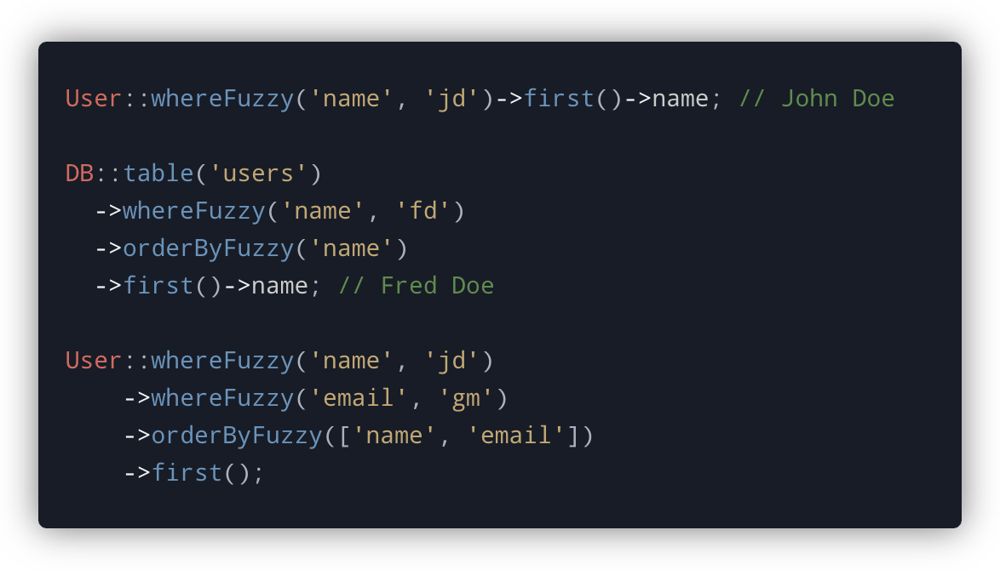

<!-- Screenshot -->
<p align="center">
    
</p>

# Quest

This package enables pseudo fuzzy-searching within Laravel database and Eloquent queries. Due to its pattern matching methods, it only supports **MySQL** or **MariaDB**, though I welcome any PRs to enable support for databases like Postgres.

Much of this library is based on the fantastic work of Tom Lingham for the now abandoned [Laravel Searchy](https://github.com/TomLingham/Laravel-Searchy) package. If you're interested in the background of how the fuzzy searching works, check out the readme for that project.

## Installation

Pull in the package using composer

```bash
composer require mattkingshott/quest
```

## Usage

Quest automatically registers a service provider containing several macros. These macros are then attached to the underlying `Illuminate\Database\Query\Builder` class.

### Filtering results

You can perform a fuzzy-search by calling the `whereFuzzy` method. This method takes two parameters. The first, is the field name. The second, is the value to use for the search e.g.

```php
DB::table('users')
  ->whereFuzzy('name', 'jd') // matches John Doe
  ->first();

User::whereFuzzy('name', 'jd') // matches John Doe
    ->first();
```

You can also perform a fuzzy search across multiple columns by chaining several `whereFuzzy` method calls:

```php
User::whereFuzzy('name', 'jd')  // matches John Doe
    ->whereFuzzy('email', 'gm') // matches @gmail.com
    ->first();
```

You can also perform searches across multiple columns using `orWhereFuzzy` method calls:
```php
User::whereFuzzy(function ($query) {
    $query->orWhereFuzzy('name', 'jd'); // matches John Doe
    $query->orWhereFuzzy('email', 'gm'); // matches @gmail.com
})->first();
```

### Ordering results

When using Quest, a `'fuzzy_relevance_*'` column will be included in your search results. The `*` is a wildcard that will be replaced with the name of the field that you are searching on e.g.

```php
User::whereFuzzy('email', 'gm') // fuzzy_relevance_email
```

This column contains the score that the record received after each of the fuzzy-searching pattern matchers were applied to it. The higher the score, the more closely the record matches the search term.

Of course, you'll want to order the results so that the records with the highest score appear first. To make this easier, Quest includes an `orderByFuzzy` helper method that wraps the relevant `orderBy` clauses:

```php
User::whereFuzzy('name', 'jd')
    ->orderByFuzzy('name')
    ->first();

// Equivalent to:

User::whereFuzzy('name', 'jd')
    ->orderBy('fuzzy_relevance_name', 'desc')
    ->first();
```

If you are searching across multiple fields, you can provide an `array` to the `orderByFuzzy` method:

```php
User::whereFuzzy('name', 'jd')
    ->whereFuzzy('email', 'gm')
    ->orderByFuzzy(['name', 'email'])
    ->first();

// Equivalent to:

User::whereFuzzy('name', 'jd')
    ->orderBy('fuzzy_relevance_name', 'desc')
    ->orderBy('fuzzy_relevance_email', 'desc')
    ->first();
```
### Applying a minimum threshold

When using Quest, an overall score will be assigned to each record within the `_fuzzy_relevance_` column. This score is represented as an `integer` between 0 and 100.

You can enforce a minimum score to restrict the results by using the `withMinimumRelevance()` method. Setting a higher score will return fewer, but likely more-relevant results.

```php
// Before
User::whereFuzzy('name', 'jd')
    ->having('_fuzzy_relevance_', '>',  70)
    ->first();

// After
User::whereFuzzy('name', 'jd')
    ->withMinimumRelevance(70)
    ->first();
```

When using `orWhereFuzzy` include the minimum relevance as an optional third parameter

```php
// Returns results which exceed 70 on the name column or 90 on the email column
User::whereFuzzy(function ($query) {
    $query->orWhereFuzzy('name', 'jd', 70);
    $query->orWhereFuzzy('email', 'gm', 90);
})->get();
```

## Limitations

It is not possible to use the `paginate` method with Quest as the relevance fields are omitted from the secondary query that Laravel runs to get the count of the records required for `LengthAwarePaginator`. However, you can use the `simplePaginate` method without issue. In many cases this a more preferable option anyway, particularly when dealing with large datasets as the `paginate` method becomes slow when scrolling through large numbers of pages.

## Contributing

Thank you for considering a contribution to Quest. You are welcome to submit a PR containing improvements, however if they are substantial in nature, please also be sure to include a test or tests.

## License

The MIT License (MIT). Please see [License File](LICENSE.md) for more information.
